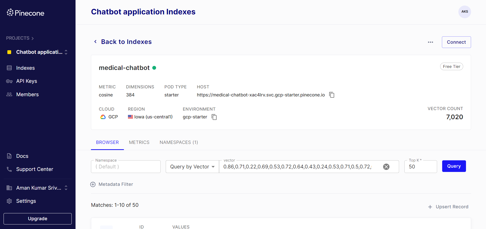
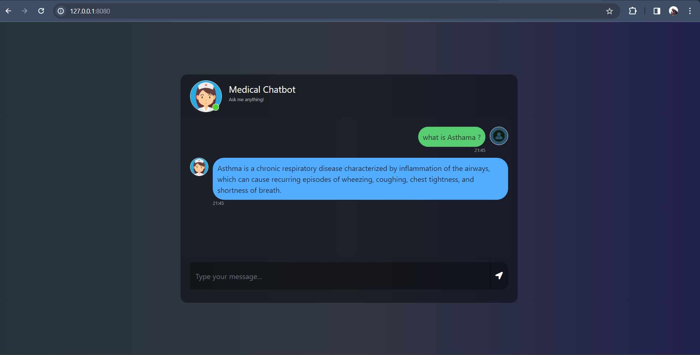
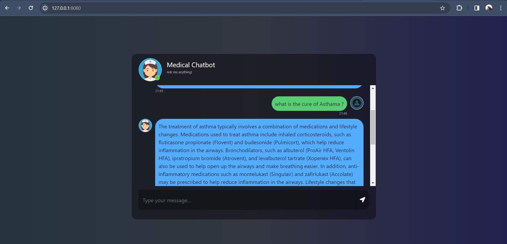

## End-to-End-Medical-Chatbot-using-Llama-2
- Created An end to end medical chatbot that will answer to your queries from medical backgound
- This Chatbot has been trained on good amount of data from a Medical handbook
- Internally this chatbot uses pinecone indexing and semantic search strategy to pull relevant data from Knowledge Base based on user query.
- It uses Cosine similarity and mini language model to create embedding
- It uses Llama 2 7B parameters LLM to generate response based on retrieved Chunks
- The Frontend UI part has been taken from a template website
- PFA screenshot of final output below

# Tech stack used -
- Python
- LLM model - LLama-2-7b-chat-ggmlv3.q4
- Vector Database - PineCone
- Embedding Model - sentence-transformers/all-MiniLM-L6-v2
- Langchain
    - Prompt Template
    - RetrievalQA
    - pinecone
    - CTransfomers (For loading quantized llama model)
- Huggingface

# Data used - Medical Handbook
- Pages - 637
- total tokens - 7020

# Steps to run the Project ->
- Clone My github Repo 

- Create and activate virtual environment using below codeon your cmd inside your project File
    python -m venv mchatvenv python=3.8
    mchatvenv\Scripts\activate.bat

- Go to Pinecone website and create your api key and index named as "medical-chatbot"

- Create .env file and paste your api_key and env like this -
    PINECONE_API_KEY = "xxxxxxxxxxxxxxxxxxxxxxxxxxxxx"
    PINECONE_API_ENV = "xxxxxxxxxxxxxxxxxxxxxxxxxxxxx"

- Download the quantize model from the link provided in model folder & keep the model in the model directory: 
    Link - https://huggingface.co/TheBloke/Llama-2-7B-Chat-GGML/tree/main
    Model - llama-2-7b-chat.ggmlv3.q4_0.bin

- Run the store_index.py file to store data and embeddings in your pinecone database

- Once 7020 elements has been pushed, Run app.py

- open up localhost:

# Screenshot of Pinecone index - 

# Screenshot of Final UI - 

